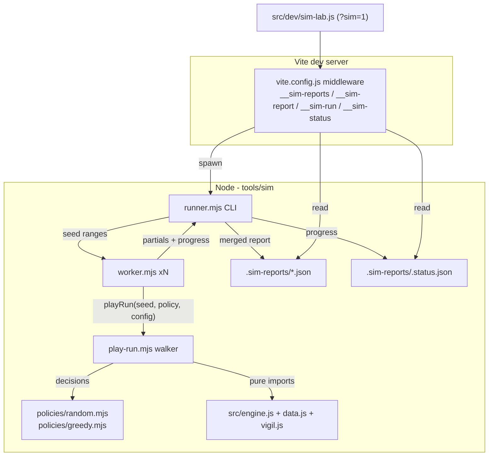

# Proving Grounds Automated Playtesting Harness - Plan

## Goal Capsule

- **Objective:** Ship the Proving Grounds harness per the origin spec: a deterministic Node `worker_threads` simulator in `tools/sim/` where a random baseline and a greedy heuristic bot play full runs through the pure engine at 100k scale, emitting a versioned telemetry report; a dev UI page (`?sim=1`) that visualises and compares reports and triggers runs; `sim:smoke` in the CI unit lane; then a 100k-run audit of `main` with a findings write-up.
- **Authority hierarchy:** origin spec > this plan > repo conventions (`CLAUDE.md`) > implementer judgment. The spec is owner-approved; conflicts between spec and discovered engine reality are surfaced, not silently resolved.
- **Stop conditions:** stop and surface if an engine change appears necessary (the harness is a read-only consumer of `engine.js`/`data.js`/`vigil.js`); if greedy cannot decisively beat random after the tuning procedure; or if wall-clock for a 100k-run sweep equivalent materially exceeds R4's single-digit-minute bound (~10 minutes) on a development laptop — the U8 audit invocation totals ~400k plays (≈4 sweep equivalents), so this threshold applies per 100k-run sweep, not to the audit's total.
- **Working-tree constraint:** pre-existing edits (`src/battlefield-layout.js`, `src/char-meta.js`, untracked `.ci-jobs/`) belong to the user, not this feature — never stage or commit them. Work on a fresh branch off `main`. The uncommitted origin spec file is part of this feature and is committed with it.

---

## Product Contract

### Summary

The engine was kept DOM-free so it could be driven headless; this feature is that payoff. A pluggable policy interface plays complete runs (map, combat, rewards, shops, events) through the real engine — no mocked combat — at Monte Carlo scale. The greedy policy makes decisions a human plausibly would, using only the engine's preview mirrors (no hidden state). The output is balance telemetry and reproducible bug captures; the consumer surfaces are a JSON report, a dev UI page, and a committed audit write-up.

### Problem Frame

Post-Round-5 `main` has never been played at scale by anything smarter than a random agent (300 runs in `npm test`, ~1 win). Win rate, difficulty curve, card/relic value, and latent engine bugs under deep state combinations are all unmeasured. Manual playtesting cannot produce 100k samples; the existing random agent cannot produce interpretable balance numbers.

### Requirements

**Simulation core**

- R1. A policy interface plays full runs headless through the pure engine; exactly two policies ship: `random` (floor baseline, behaviourally equivalent to the `test_engine.js` monte-carlo agent) and `greedy` (heuristic decisions built on `previewPlay`/`previewBlock`/`previewEnemyDmg`).
- R2. Deterministic sweeps: identical CLI flags produce a byte-identical report (excluding `meta.date`/`meta.durationMs`/`meta.workers`), independent of `--workers`; run *i* derives entirely from seed `base + i`.
- R3. Engine errors, invariant breaches (hp/ember/chip/gold/energy bounds, termination, deck integrity), and illegal policy actions are captured as `issues` entries with seed + phase + stack, without aborting the sweep; every issue reproduces via a single-run CLI invocation.
- R4. 100k runs complete in single-digit minutes on all cores via `worker_threads`.

**Telemetry**

- R5. Report schema v1 (versioned JSON in gitignored `.sim-reports/`): headline win rates with Wilson 95% intervals sliced by aspect × vow × profile, act-reach funnel, deaths by act/row/enemy/kind, per-card offer/pick/winRateWhenDrafted, per-relic seen/taken/winRateWhenTaken, combat economy (turns per fight, damage rates, overkill, energy waste, kindle/art/potion usage, potions held at death), issues, and auto-computed balance flags per the origin spec's thresholds.

**Surfaces**

- R6. Dev-only vite endpoints: `GET /__sim-reports` (list), `GET /__sim-report?f=` (fetch, basename-sanitised), `POST /__sim-run` (spawn CLI, 409 when busy), `GET /__sim-status` (progress poll).
- R7. Proving Grounds page at `?sim=1` (DEV-gated full takeover like `?charedit=1`): report list + run panel with live progress, and six tabs — Headline, Deaths, Cards/Relics, Economy, Issues, Compare — using hand-rolled SVG charts, game fonts/palette, no chart library.

**Quality gates**

- R8. `npm run sim:smoke`: 300 runs per policy, asserts zero engine-error/invariant issues, greedy wins > random wins, determinism (identical aggregates on repeat), termination; joins the CI unit lane. Module-boundary checks: `tools/sim/**` imports only Node-safe modules, contains no `Math.random(`, `src/dev/sim-lab.js` imported only from the `main.js` DEV branch.
- R9. Existing instruments untouched: `test/test_engine.js`, `tools/emberglass-pacing.mjs`, all engine/vigil/data modules.

**Audit**

- R10. After the tool lands: 100k runs × both policies × both profiles on `main`, findings committed as a docs write-up (bugs with repro seeds, balance flags with interpretation).

### Scope Boundaries

Deferred to follow-up work (from origin spec): lookahead/expectimax bot, persona weight profiles, in-browser Web-Worker sims, career-mode sims through vigil persistence, nightly CI trend line, per-card play-time attribution, in-game seed-replay viewer, Playwright coverage for the dev page.

Out of scope: any change to game balance itself (the audit reports; the owner decides), engine mechanics, production bundle behaviour (`?sim=1` is DEV-only).

---

## Planning Contract

### Key Technical Decisions

- KTD1. Sims run in a Node CLI on `worker_threads` with a thin dev UI viewer that can trigger runs via dev-server endpoints. (session-settled: user-approved — chosen over fully in-browser Web-Worker sims or a CLI-only static report: Node threads reach 100k in minutes, results persist, and the runner is CI-able.)
- KTD2. Exactly two policies, `random` and `greedy`, behind one interface. (session-settled: user-approved — chosen over a single bot or tunable personas: the random floor brackets balance interpretation without multiplying runtime.)
- KTD3. `test_engine.js` monte-carlo and `emberglass-pacing.mjs` stay untouched; the random policy re-implements the monte-carlo behaviour under the new interface. (session-settled: user-approved — chosen over refactoring `test_engine.js` to share code: they are a correctness smoke and a pacing instrument with different jobs; the smoke stays self-contained.)
- KTD4. No CI balance gating, no nightly; only deterministic `sim:smoke` joins the unit lane. (session-settled: user-approved — chosen over gated/nightly balance CI: this is an on-demand instrument.)
- KTD5. v1 runs carry no quest snapshot, leaving the Emberglass chain dormant. (session-settled: user-approved — chosen over career-mode sims through vigil persistence: quest pacing already has its own instrument.)
- KTD6. The walker (`play-run.mjs`) owns all game flow, legality, guards, invariants, and telemetry capture; policies are pure decision callbacks. Rationale: one proven-terminating flow (mirroring `randomAgentRun`, test/test_engine.js:3973) instead of two, and invariants live in one place.
- KTD7. Policies draw from their own `mulberry32(seed ^ const)` stream; engine randomness (`runRng`) is never consumed by deliberation, so each policy is fully deterministic per seed and both see an identical run setup (map, omen, starting state). Trajectories diverge once decisions differ — cross-policy per-seed outcomes are aggregate-comparable, not paired samples.
- KTD8. The greedy bot reads only what the UI shows a player — preview mirrors and visible combat state — never re-implementing damage math and never peeking at engine RNG or undrawn cards. `previewPlay` returns `null` for pure-utility cards; the scorer has an explicit statusEV/draw-value branch for that case.
- KTD9. Invariant breaches and engine exceptions are recorded as `issues`, not thrown: a 100k sweep surviving a bug is the point. First 100 issues carry full detail; the rest count by error signature.
- KTD10. Aggregate merging is partition-independent (associative merge over sorted keys), so `--workers N` never changes the report bytes; the sweep cell (aspect/vow/boon/monument) is a pure function of the run's seed — mirroring `randomAgentRun`'s seed-based pattern (test/test_engine.js:3976-3979), a surfaced deviation from the origin spec's index-based formulas so that `--runs 1 --seed K` reproduces the original run's cell exactly (R3).

### High-Level Technical Design

Import direction is load-bearing (mirrors the repo's golden rule): everything in `tools/sim/` imports only `src/engine.js`, `src/data.js`, `src/vigil.js`, and siblings — never stage/ui/audio modules. `src/dev/sim-lab.js` is browser-only and imported only from `main.js`'s DEV branch.

### Assumptions

- Greedy weights are implementation-time values; the tuning procedure is fixed by the spec (maximise greedy win rate over a fixed 2,000-seed set) and the tuned table lands as an exported const with the sweep recorded in the unit's commit.
- The dev page is desktop-first with high visual craft (repo's standing quality bar) but needs no LITE tier, touch layout, or Playwright coverage in v1.
- Per-run cost of the greedy bot stays in the 5–30ms band, keeping 100k in single-digit minutes; the stop condition in the Goal Capsule fires if this proves wrong.

---

## Implementation Units

### U1. Walker, policy contract, and random policy

- **Goal:** `playRun(seed, policy, config) → runRecord` drives one complete run through the real engine; the `random` policy reproduces the monte-carlo agent's behaviour under the policy contract.
- **Requirements:** R1, R2, R3, R9. Cites KTD3, KTD6, KTD7, KTD9.
- **Dependencies:** none.
- **Files:** `tools/sim/play-run.mjs`, `tools/sim/policies/random.mjs`.
- **Approach:** Flow mirrors `randomAgentRun` (test/test_engine.js:3973) step for step — node loop ≤ 400, combat loop ≤ 200 turns, ≤ 40 policy actions per turn, `cb.queue.length = 0` drain per turn, same reward/boss/act-transition/heal sequence. Policy contract per the origin spec (`pickNode`, `combatAction`, `pickCardReward`, `pickBossRelic`, `restDecision`, `eventChoice`, `eventPending`, `shopPlan`). Sweep cell (aspect, vow level, boon, monument) derived from the run's seed — aspect = `seed % ASPECTS.length`, vow = `floor(seed / ASPECTS.length) % (VOWS.length + 1)`, boon cycling and monument (`seed % 4 === 0`) likewise seed-derived, per KTD10's surfaced deviation from the spec's index formulas — so `--runs 1 --seed K` replays the exact cell; `fresh` profile builds a reveal snapshot via `vigil.js` `_setStore`/`loadVigil`/`revealSnapshot` (pattern: tools/emberglass-pacing.mjs). Invariants recorded into `runRecord.issues`, never thrown; illegal policy actions are flagged `policy-illegal` and fall back deterministically — end turn in combat, first legal option/skip for map, reward, rest, event, and shop decisions — so fallbacks never violate R2. `runRecord` carries outcome, per-fight stats, draft/shop/event decisions, and issue list — the reduction input for U3.
- **Patterns to follow:** `randomAgentRun` walk order and asserts; `mulberry32` from tools/emberglass-pacing.mjs; no `Math.random`.
- **Test scenarios** (realised in U5's smoke): 300 random-policy seeds all terminate with zero engine-error/invariant issues; win count magnitude comparable to the monte-carlo's (~0–3 wins/300); same seed twice → deep-equal `runRecord`; a policy returning an unplayable card uid yields one `policy-illegal` issue and the run still terminates; fresh-profile runs never offer reveal-gated cards/relics (spot-check via `runRecord` draft offers).
- **Verification:** ad-hoc `node` driver plays 300 seeds in-process without error; formal gate arrives with U5.

### U2. Greedy policy

- **Goal:** The heuristic bot: preview-scored combat play, state-aware pathing, value-table drafting/shopping, per the origin spec's scoring shape.
- **Requirements:** R1. Cites KTD2, KTD7, KTD8.
- **Dependencies:** U1.
- **Files:** `tools/sim/policies/greedy.mjs`.
- **Approach:** Combat: enumerate playable card × legal target, score via `previewPlay` (lethal bonus, unblocked loss, overkill penalty, shatter/chip value, block clamped to incoming from `previewEnemyDmg`, statusEV table, energy cost weight); explicit null-preview branch for utility cards; kindle/art/potion rules and map/draft/shop/event heuristics per spec. Weights exported as one const table; tune by sweeping candidate tables over a fixed 2,000-seed set and keeping the win-rate maximiser.
- **Patterns to follow:** preview mirror shapes at src/engine.js:1721-1786; card/relic tables in `src/data.js` for the static value table.
- **Test scenarios** (realised in U5's smoke): greedy wins strictly exceed random wins over the same 300 seeds; greedy average fight length shorter than random's; determinism (same seed twice → identical `runRecord`); zero `policy-illegal` issues from greedy across the smoke seeds.
- **Verification:** tuning sweep output recorded; U2's smoke-realised test scenarios checked via the U1 ad-hoc in-process driver over the smoke seed set (formal gate arrives with U5).

### U3. Telemetry reducer and balance flags

- **Goal:** `runRecord[] → aggregate` reduction, partition-independent `merge(a, b)`, sorted stable serialisation, Wilson intervals, and the spec's auto-flag thresholds.
- **Requirements:** R2, R5. Cites KTD10.
- **Dependencies:** U1.
- **Files:** `tools/sim/telemetry.mjs`.
- **Approach:** Aggregate holds integer counters/sums only (no raw records, no running float statistics — rates, averages, and Wilson bounds are computed once at finalise, keeping the merge associative) so worker partials stay small; all maps serialised with sorted keys; flags computed at finalise time from the aggregate; schema `meta.schema = 1`. Two surfaced additive extensions to the origin spec's schema (per the authority hierarchy): `headline.byAspectVow` (win rate + n per aspect×vow cell — U7's matrix needs the joint slice, not just 1-D `byAspect`/`byVow`) and a per-enemy encounter-count map (the U7 encounter-share overlay and the kill-share > 2× encounter-share flag both need it; neither is reconstructible later from a counters-only aggregate).
- **Patterns to follow:** report schema section of the origin spec, verbatim key names.
- **Test scenarios** (realised in U5's smoke plus inline self-checks): `merge(reduce(A), reduce(B))` deep-equals `reduce(A ∪ B)` for a split of the smoke records; serialisation of the same aggregate twice is byte-identical; Wilson interval brackets the point estimate and narrows with n; each flag threshold fires on a synthetic aggregate built to trip it and stays silent one unit below threshold.
- **Verification:** smoke determinism assertion (c) exercises the full reduce/merge/serialise path.

### U4. Runner CLI and worker orchestration

- **Goal:** `npm run sim -- --runs N --policy greedy|random|both --seed S --profile revealed|fresh|both --workers auto|N --label L [--out path]` spawns workers over contiguous seed blocks, merges partials, writes the report and `.status.json` progress.
- **Requirements:** R2, R3, R4, R5. Cites KTD1, KTD10.
- **Dependencies:** U1, U2, U3.
- **Files:** `tools/sim/runner.mjs`, `tools/sim/worker.mjs`, `package.json` (scripts `sim`, `sim:smoke`), `.gitignore` (`.sim-reports/`).
- **Approach:** `worker_threads` with module workers; progress messages every 250 runs; `meta` stamps date, `git rev-parse --short HEAD`, dirty flag, config echo, duration; `--policy both` runs both sweeps over the same seeds into one report with per-policy sections; issue detail capped at 100 with signature counts beyond — the cap is applied after merging partials in seed order, never in message-arrival order. The runner writes its pid into `.status.json` and finalises status on exit/signal (`running: false`, plus an `error` message on abnormal exit), so an interrupted sweep never leaves a phantom in-progress state.
- **Test scenarios** (realised in U5's smoke): identical flags twice → byte-identical reports minus `meta.date`/`meta.durationMs`; `--workers 1` vs `--workers 4` → identical aggregates; single-run repro (`--runs 1 --seed K`) of a seeded issue reproduces the same issue signature; `--out` respected; `.status.json` reaches `done === total`.
- **Verification:** `npm run sim -- --runs 2000 --policy both` completes locally and the report loads as JSON.

### U5. Smoke mode, CI unit lane, module boundaries

- **Goal:** The durable quality gates: `--smoke` assert mode, `sim:smoke` in CI's unit job, and boundary pins.
- **Requirements:** R8, R9. Cites KTD4.
- **Dependencies:** U4.
- **Files:** `tools/sim/runner.mjs` (`--smoke`), `.github/workflows/ci.yml` (`unit_tests` job, after `npm test` at line ~94), `test/test_module_boundaries.mjs`.
- **Approach:** Smoke = fixed seed, 300 runs per policy per profile (both policies, both profiles — U1's fresh-profile reveal-gating scenario needs the fresh slice), exits non-zero on: any engine-error/invariant issue; greedy wins ≤ random wins; non-identical repeat aggregates (50-run re-run); non-termination; any `policy-illegal` issue from greedy; an injected faulty-policy probe not yielding exactly one `policy-illegal` issue with its run still terminating; same-seed re-run `runRecord`s not deep-equal; any reveal-gated card/relic offered in fresh-profile runs; greedy average fight length not below random's. Boundary additions: import whitelist for `tools/sim/**`; `Math.random(` ban in `tools/sim/`; `src/dev/sim-lab.js` referenced only from the `main.js` DEV branch.
- **Patterns to follow:** existing `importSpecifiers` helper in test/test_module_boundaries.mjs; `unit_tests` job step order in .github/workflows/ci.yml.
- **Test scenarios:** the smoke assertions themselves (the origin spec's (a)–(d) plus the U1/U2-realised assertions enumerated in the Approach); boundary test fails when a `tools/sim` file imports `../src/stage.js` (verified by temporary mutation during development, not committed); `npm run test:ci` and `npm test` remain green.
- **Verification:** `npm run sim:smoke` green locally; CI unit lane green on the PR.

### U6. Dev-server endpoints

- **Goal:** The four dev-only middleware routes wired into the existing `configureServer` plugin.
- **Requirements:** R6. Cites KTD1.
- **Dependencies:** U4.
- **Files:** `vite.config.js` (middleware block, near `/__audio-save` at ~line 94).
- **Approach:** List/fetch read `.sim-reports/` (fetch sanitises to basename, rejects traversal); run validates the JSON body before spawning — `runs` integer, clamped; `seed` integer; `policy`/`profile` from literal enums; `label` restricted to `[A-Za-z0-9._-]`; no `out` field accepted; anything else → 400 (the `/__bf-save`/`/__audio-save` validate-then-act pattern) — then spawns `node tools/sim/runner.mjs` as an argv array (no shell), detached; 409 while `.status.json` says running AND its recorded pid is alive (a dead pid is treated as not-running, so an interrupted CLI sweep never wedges the endpoint); status returns the file or `{running:false}`. Same-origin posture as existing save gates; endpoints exist only under `configureServer` (dev), so production builds are untouched.
- **Patterns to follow:** `/__audio-save` and `/__bf-save` middleware in vite.config.js:82-160.
- **Test scenarios:** Test expectation: none automated — repo precedent (existing `__*-save` endpoints ship untested; DEV-only surface). Manual checks during implementation: traversal attempt (`?f=../package.json`) → 4xx; malformed body (`label` with `/`, non-enum `policy`, unexpected `out` field) → 400; double `POST /__sim-run` → second gets 409; kill the runner mid-sweep → next POST succeeds (dead-pid recovery); status transitions running→done.
- **Verification:** curl checks against `npm run dev` pass; `npm run build` output contains no endpoint code.

### U7. Proving Grounds page

- **Goal:** `?sim=1` dev page: report rail + run panel with 1 Hz progress polling, six tabs (Headline, Deaths, Cards/Relics, Economy, Issues, Compare), hand-rolled SVG charts, flags banner, stained-glass styling.
- **Requirements:** R7. Cites KTD1.
- **Dependencies:** U6.
- **Files:** `src/dev/sim-lab.js`, `src/main.js` (DEV branch alongside `charedit`/`vfxedit`).
- **Approach:** Full takeover (game does not boot); module injects its own styles like the existing dev editors; charts per spec (Wilson CI bars, aspect×vow matrix, act funnel, act/row heat grid over the 15-row silhouette, per-enemy kill bars with encounter-share overlay, sortable tables with delta tinting, copy-seed buttons with repro command, A/B delta columns). A `--policy both` report (the flagship U8/DoD shape) gets a policy selector that switches all six tabs between the per-policy sections. The Compare tab has its own A/B report pickers (the rail stays single-select). Failure state: when the runner exits non-zero, the status `error` surfaces as an error banner and the run form re-enables. Empty state: with no reports, the rail says so and tabs render neutral prompts instead of blank charts. Visual craft to the repo's standing bar — this is a product-adjacent instrument, not a throwaway page.
- **Patterns to follow:** `src/dev/char-editor.js` takeover/boot pattern; `iconSvg` from `src/art.js` for any structural icons; game CSS variables for palette.
- **Test scenarios:** Test expectation: none automated — Playwright for the dev page is explicitly deferred (Scope Boundaries). Manual checklist: loads latest report by default; every tab renders from a real 2,000-run report; the policy selector flips all six tabs on a `--policy both` report; run panel launches, shows live progress, and auto-loads the finished report; a failed run shows the error banner and re-enables the form; empty `.sim-reports/` shows the empty state; Compare's A/B pickers select two reports and show signed deltas; page never fetches in production build.
- **Verification:** manual checklist complete against a real report; `npm run build` green (page is lazy DEV-only, entry budget unaffected).

### U8. 100k audit of main and findings write-up

- **Goal:** The deliverable the harness exists for: 100k runs × both policies × both profiles against post-Round-5 `main`, findings committed.
- **Requirements:** R10. Cites KTD5.
- **Dependencies:** U2, U4, U5.
- **Files:** `docs/sim-audits/2026-07-17-proving-grounds-audit.md` (new), report JSONs stay local (gitignored).
- **Approach:** Run the sweep; triage `issues` (every engine-error/invariant gets a repro seed and a one-line diagnosis — fixes are out of scope for this plan; engine changes remain governed by the Goal Capsule stop condition and R9, and fix work happens in a follow-up plan seeded from the findings doc); interpret balance flags (never-picked cards, outlier enemies, aspect/vow spread, potion hoarding); write the findings doc with the exact CLI invocations so results are reproducible.
- **Test scenarios:** Test expectation: none — analysis deliverable; its rigour gate is that every claim carries a number from the report and every bug carries a repro seed.
- **Verification:** findings doc committed; each listed repro seed re-triggers its issue via the single-run command.

---

## Verification Contract

| Gate | Command | Applies to |
|---|---|---|
| Engine self-check unchanged | `npm test` | U1–U5 (must stay green, untouched file) |
| Contract + boundaries | `npm run test:ci` | U5 boundary additions |
| Sim smoke (new) | `npm run sim:smoke` | U1–U5 assertions |
| Build + budget | `npm run build` | U6–U7 (dev-only code must not grow the entry) |
| Browser smoke | `npm run test:e2e:smoke` | U7 (`main.js` boot branch touched) |
| Live sweep | `npm run sim -- --runs 2000 --policy both` | U4/U7 manual verification input |

CI: the PR must pass the full Ready-mode gate (`unit` and `e2e` aggregates). Draft-mode green is not evidence (repo lesson: Draft `p2-base` skips webkit/leak/visual lanes).

---

## Definition of Done

- All eight units land; every Verification Contract gate green locally and in Ready-mode CI.
- `sim:smoke` runs in the CI unit lane and is deterministic across two consecutive local invocations.
- A 100k `--policy both --profile both` sweep completes on `main`'s code, and the findings doc in `docs/sim-audits/` reports win rates with intervals, every captured issue with a repro seed, and an interpretation of each fired balance flag.
- No pre-existing user working-tree edits (`src/battlefield-layout.js`, `src/char-meta.js`, `.ci-jobs/`) staged or committed; no abandoned experimental code in the diff; `.sim-reports/` gitignored.
