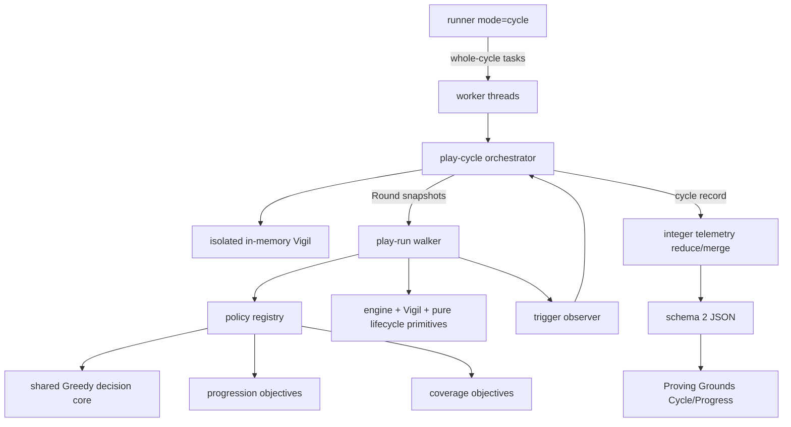

# Proving Grounds Machine Logic and Full Cycle Telemetry - Plan

## Goal Capsule

- **Objective:** Extend the merged PR31 Proving Grounds from independent Climb sweeps into a deterministic progression instrument. Add purposeful Machine Logic that can complete the real Emberglass paths, run persistent-Vigil Full Cycles, and report Round win rate, Rounds to the Act IV promise, progressive suffix win rate, and auditable edge/event trigger funnels.
- **Authority hierarchy:** this Product Contract > current engine/Vigil domain contracts > the merged PR31 simulator design > implementation judgement. `Climb`, `Dawn`, `Fall`, `Vigil`, `Emberglass Quest`, and `Act IV promise` retain their canonical repo meanings.
- **Truth constraint:** current production content has three playable Acts. This work must never generate, simulate, or report playable Act IV content. The Act IV endpoint is the six-Shard `act4` reveal and sealed-door promise.
- **Working-tree constraint:** implement only in `jamesto/sim-machine-logic-round-cycles` at the isolated worktree. The user's pre-existing edits in the original checkout (`src/battlefield-layout.js`, `src/char-meta.js`, `.ci-jobs/`, and the session transcript) remain untouched and uncommitted by this work.
- **Report-conflicts rule:** if evidence shows a settled decision cannot work, report it — do not suppress it.

---

## Product Contract

### Summary

Proving Grounds will gain two purposeful policy surfaces and a new Full Cycle mode. `progression` behaves like a guided player pursuing disclosed Emberglass goals while preserving Greedy combat strength; `coverage` is an explicitly QA-only objective hunter. A Full Cycle owns one fresh Vigil and plays sequential Rounds until the Act IV promise is delivered or a deterministic Round cap censors the cycle.

### Problem Frame

PR31 proved that the engine can sustain deterministic 400,000-play sweeps, but its two policies answer a narrow question. Random is a useful legality floor yet wins only 0.073% of the audited population, so it almost never reaches late progression. Greedy wins 84.4435% and is useful for combat balance, but every simulated Climb is ephemeral: no quest snapshot, Shards, persistent monument, arming cadence, or run-end Vigil commit survives into another Climb.

That boundary excludes the long-game questions now being asked. The Usurper requires an Act II merchant, a deliberate 650-gold purchase, and a same-Round Act III Dawn. The Hollow Lamplighter requires repeated Unlit Way meetings and five different prices across Rounds. Your Own Shade requires a qualifying Fall followed by a later monument duel. Random repetition cannot make these conditions meaningful, and the current walker lacks several of the legal actions entirely.

The existing `tools/emberglass-pacing.mjs` proves the tuning target (~20 guided wins, ~50 unguided wins), but it rigs acts, gold, HP, and combat. It remains a pacing fixture, not live-flow proof. The enhanced Proving Grounds must reach the same state transitions through normal map, shop, combat, terminal, and Vigil paths.

### Requirements

#### Vocabulary and lifecycle

- **R1. Round:** one existing canonical **Climb** from Embark through playable Acts I–III, ending in exactly one Run Outcome: Dawn, Fall, or simulator error. `Round` is a report alias; it does not replace the `Climb` domain term in game code or player copy.
- **R2. Full Cycle:** an ordered sequence of Rounds sharing one isolated Vigil, starting from a fresh profile and ending when the canonical `act4Reveal` sealed-door promise is durably staged to a specific Round/run id, when `maxRounds` is reached and the cycle is reported as censored, or when a simulator error terminates the cycle as failed. A failed cycle retains the errored Round and reproduction evidence, starts no later Round from possibly partial state, and is excluded from completion-timing statistics. Six Shards / `isRevealed(vigil, 'act4')` is the unlock threshold; durable staging, not visual playback, is the completion endpoint.
- **R3. No fourth playable Act:** no Round may increment beyond Act III, create an Act IV map, or treat the promise as another combat win. Reports must label the endpoint `Act IV promise`, not `Act IV victory`.

#### Machine Logic

- **R4. Policy catalogue:** preserve `random` as an opt-in floor baseline and `greedy` as the PR31 win-first policy. Add `progression` and `coverage` as separately named, versioned policies behind one Node-safe registry used by runner, worker, smoke, dev middleware, and report UI.
- **R5. Progression policy:** compose the existing Greedy combat/drafting evaluator with strategic objectives that use only a walker-owned, frozen observation and legal-action set. It may pursue disclosed/known quest goals, preserve a live opportunity, prepare the next gate, and otherwise maximise Dawn probability. Policy modules must not receive mutable `run`/`cb`, import the engine, or observe engine RNG, draw-pile order, unrevealed quest identity, or hidden map faces.
- **R6. Coverage policy:** compose the same legal combat core with an explicit target catalogue to drive one eligible edge at a time. It may receive harness-level objective/eligibility metadata, but not future RNG or undrawn state. Its reports are labelled `coverage-only` and excluded from player/balance interpretations.
- **R7. Objective arbitration:** the deterministic priority is: finish an active target > preserve an existing cross-Round opportunity > prepare the target's next prerequisite > generic win. An intentional Fall is legal only when the coverage/progression objective is the eligible Your Own Shade setup; it remains a Round loss and is separately counted as a successful setup trigger.

#### Live-flow parity

- **R8. Round walker parity:** add legal decisions and real engine calls for Lamplighter boon/Art choice, quest-item purchase, shop card removal, Hollow pay/leave and routed continuation, standing monument/Shade duel, boss-relic skip, qualifying Fall/bequest, and terminal Vigil commits. The walker must pass the visited node to `rollEncounter`, filter event/phial choices exactly like live UI, use `restHealFrac`, and use the live act transition (new Omen plus 35% heal).
- **R9. Persistent Vigil:** each Full Cycle Round starts from `questSnapshot(vigil)`, `revealSnapshot(vigil)`, `unlocks`, `shards`, and `lastFall`; terminal processing uses the real Vigil commit order and receipts. No quest progress, Shard, reveal, unlock, Hollow debt, arming state, or standing monument may be copied by simulator-only mutation.
- **R10. Act IV delivery edge:** for newly canonicalised ledgers, the Act IV promise follows `locked -> pending -> staged(runId)`. The sixth-Shard crossing writes `pending` in the same Vigil update as the Shard, regardless of Run Outcome. The first eligible Dawn persists a pending-Dawn queue containing `act4Reveal`, then claims `staged(runId)`; reload repair reconciles either half-written side to the same run id. No later Round may stage it. Visual playback is at-least-once after a crash because the Dawn cursor and display cannot be atomic; do not call it visual exactly-once.

#### Telemetry

- **R11. Per-Round win rate:** for each Round ordinal, report `started`, `dawns`, `falls`, `errors`, win rate, and Wilson 95% interval. The denominator is cycles that actually reached that ordinal; report the at-risk count to expose survivor/censoring effects. Each cycle contributes at most one observation to an ordinal cell.
- **R12. Rounds to the Act IV promise:** report cycles started/completed/censored/failed, completion and censoring rates, a deterministic completed-cycle histogram, mean, and p10/p50/p90 among completed cycles. Add deterministic Kaplan-Meier event/censor cells, restricted mean Rounds through `maxRounds`, and Kaplan-Meier quantiles when estimable so heavily censored configurations cannot appear faster merely because only their easiest cycles completed. Label completed-only timing as descriptive. Also report the Round of six-Shard threshold separately from the Round of `act4Reveal` delivery. With zero completed cycles, completion-only values render unavailable with `No completed cycles`, while censor/failure counts and Round-at-risk data remain visible.
- **R13. Progressive suffix win rate:** for each Round ordinal *k*, report Dawn rate over all attempted Rounds from *k* onward with `n` and a deterministic whole-cycle cluster-bootstrap 95% interval; the report metadata names the method and resample count. For every completed cycle, `perfectSuffixStart` is the earliest Round *k* for which every Round *k* through completion ended at Dawn; report its histogram and p10/p50/p90. This exactly answers “from Round 3 onward, was win rate 100%?” without silently applying a tolerance. Wilson intervals remain valid only for R11 ordinal cells where each cycle contributes once.
- **R14. Trigger funnels:** a versioned named trigger catalogue records integer `eligible`, `attempted`, `succeeded`, `missed`, and reason counts. Each catalogue entry defines its counting unit, eligibility predicate, chosen-action or automatic-transition attempt rule, observed success delta, de-duplication scope, and closed miss-reason set. Enforce `succeeded <= attempted <= eligible`. At minimum cover Pale hidden/marked encounter and kill; Shade qualifying Fall, standing monument, duel and win; Usurper offer/afford/buy/transformed summit/kill; Eighth Omen active/final attempt/Dawn; Page offer/take/carry/read; Hollow due/reachable/entered/paid/progressed; Shard threshold; and `act4Reveal` staged.
- **R15. Reproduction:** every cycle issue or failed target retains policy, cycle seed, Round ordinal, derived run seed, phase, trigger id/reason, explicit coverage target when used, and compact Vigil/run summary. A one-cycle CLI command must reproduce it, including `--target <trigger-id>` for explicit-target coverage cycles.

#### Runner, report, and Proving Grounds

- **R16. Mode-safe CLI:** preserve existing single-Round `--runs` behaviour under `--mode round`. Add `--mode cycle --cycles N --max-rounds N`; do not overload `--runs`. Round mode retains `fresh|revealed` profiles; cycle mode starts fresh and evolves, so it rejects a static profile flag. `random|greedy` support Round mode; `progression` supports both modes; `coverage` supports cycle mode with optional `--target <trigger-id>` and deterministic rotation by default. Mode switches clear incompatible submitted values rather than retaining hidden stale fields. Counts are positive integers, `maxRounds` is bounded by the runner safety limit, and UI/CLI defaults come from the same safe metadata contract.
- **R17. Determinism:** a cycle is the indivisible distribution atom. A worker task processes a contiguous batch of whole cycle seeds, and every Round of a cycle remains in that worker under one isolated storage session. Cycle seed plus Round ordinal deterministically derives run seed, policy seed, arming RNG, run id, Aspect/Vow/boon choices, and coverage target. Identical semantic flags produce byte-identical stable report sections independent of worker count, excluding declared volatile metadata.
- **R18. Schema compatibility:** bump the report schema for cycle/trigger data. Proving Grounds must continue opening schema-1 PR31 reports. Compare either adapts shared metrics or clearly blocks incompatible comparisons; it must never subtract unlike Round and cycle populations.
- **R19. Proving Grounds UI:** make mode, purposeful policy, cycles, max Rounds, and a coverage-only Target control explicit in the Run panel; Target is catalogue-backed, defaults to deterministic rotation, and is absent for other policies. Add a Cycle/Progress view with Round win-rate table/curve, completion/censoring and Rounds-to-the-Act-IV-promise distribution, progressive suffix view, quest/trigger funnels, and copyable cycle repros. `progression` is labelled goal-directed machine-policy evidence, not observed player win-rate proof. Coverage reports open trigger-first, badge and text-label every retained outcome as QA operational context, and cannot enter balance Compare. Visible tabs derive from loaded schema/mode; replacing an active Cycle/Progress report with schema 1 falls back to Headline. Conditional controls are labelled/grouped, tabs/copy are keyboard-operable, charts retain accessible data-table equivalents, progress/errors are announced, and narrow layouts provide usable overflow.

#### Quality gates

- **R20. Deterministic fixtures:** retain the existing single-Round smoke. Add cycle smoke covering same-config repeat, workers 1/N equivalence, max-Round censoring, failed-cycle termination, all six quest paths, sixth Shard on Fall then one `act4Reveal`, no Act IV gameplay, policy legality, and trigger-funnel invariants. A fixed-seed, unrigged `progression` canary must complete at least one fresh-to-promise Full Cycle within the declared `maxRounds`; coverage fixtures must reach every target through live-flow actions rather than simulator-only mutation.
- **R21. Browser proof:** add focused Playwright coverage for schema-1 compatibility and schema-derived tab fallback, a schema-2 cycle report including an all-censored empty state, mode/policy/target form validation, Round/Full Cycle metrics, progression interpretation copy, enforced coverage balance exclusion, a copyable explicit-target cycle reproduction command, keyboard/accessibility names, and one narrow-viewport fixture.
- **R22. Existing contracts:** `npm test`, `npm run test:ci`, `npm run test:progression`, `npm run sim:smoke`, `npm run build`, and Ready-mode CI remain green. `tools/emberglass-pacing.mjs` retains its separate guided/unguided pacing job.

### Key Flows

#### Flow A — single-Round balance sweep

1. Operator selects `mode=round`, a policy, profile, seed, and run count.
2. Existing independent Climb semantics and schema-1-compatible headline/card/economy views remain available.
3. New registry and parity primitives are used, but no Vigil state crosses between runs.

#### Flow B — progression Full Cycle

1. Operator selects `mode=cycle`, `policy=progression`, cycle count, seed, and maximum Rounds.
2. Each worker owns complete cycles. A cycle creates a fresh in-memory Vigil, starts Round 1, and commits its terminal outcome.
3. The next Round consumes the evolved Vigil. Progression logic pursues disclosed goals without hidden knowledge while Greedy combat tries to reach Dawn, except for an eligible Shade setup Fall.
4. The cycle ends completed when `act4Reveal` is successfully staged, censored at the Round cap, or failed on a simulator error; failed cycles never continue from uncertain partial state.
5. Report lab shows Round win rates, Act IV promise timing, suffix stabilisation, and quest funnels as goal-directed machine-policy evidence.

#### Flow C — targeted coverage cycle

1. Operator selects `policy=coverage` and either `--target <trigger-id>` / the matching Target control, or deterministic target rotation.
2. The orchestrator supplies only the target and current eligibility; the policy takes legal actions to attempt it.
3. Walker observes the engine transition and records eligible/attempted/succeeded or a named miss reason.
4. Coverage output is reproducible and visibly excluded from balance conclusions.

#### Flow D — sixth Shard on Fall

1. A Round completes the sixth quest before a later combat Fall.
2. Vigil commits the Shard and sets the Act IV promise pending; no fake Dawn is recorded.
3. A later Round reaches Dawn; its pending-Dawn save stages `act4Reveal`, then the Vigil records `staged(runId)`. Recovery reconciles a save between those writes to the same owner.
4. The Full Cycle completes on that staging Round. Another Round cannot claim the promise; a crash may replay the already-staged visual ceremony until its Dawn cursor advances.

### Acceptance Examples

- **AE1:** A 10-Round completed cycle with Falls in Rounds 1–2 and Dawns in Rounds 3–10 reports `perfectSuffixStart: 3`; suffix Round 3 has `wins=8`, `n=8`, `winRate=1`.
- **AE2:** A cycle capped at 30 Rounds with five Shards is `censored`, contributes to per-Round denominators through Round 30, and does not enter the completed-cycle Rounds-to-the-Act-IV-promise percentiles; its censor cell contributes to Kaplan-Meier and restricted-mean calculations.
- **AE3:** Seeing the 650-gold lantern while holding 420 gold records Usurper offer eligible/succeeded, affordability false, purchase not attempted, and reason `insufficient-gold`; it does not record a policy error.
- **AE4:** Coverage intentionally Falls in Act II to prepare Your Own Shade: Round outcome is Fall, Shade-setup trigger succeeds, and the next Round receives the standing monument through the Vigil snapshot.
- **AE5:** The sixth Shard earned before a Fall reveals `act4` and sets `pending` in the Vigil but does not fabricate `act4Reveal`; the next Dawn durably stages it to that run id and completes the cycle.
- **AE6:** A schema-1 report still opens with its original six tabs. A schema-2 cycle report adds Cycle/Progress; switching back to schema 1 while that tab is active selects Headline. Compare explains rather than computes when modes differ and never treats coverage as balance evidence.
- **AE7:** An all-censored cycle report shows completion `0`, its censor count, at-risk Round data, and `No completed cycles`; it renders no zero/`NaN` completion-time mean or percentile.

### Scope Boundaries

#### In scope

- Simulator policy/lifecycle architecture, live-flow parity, cycle orchestration, telemetry schema, runner/worker/dev endpoints, Proving Grounds UI, focused tests, and the retry-safe Act IV promise-delivery edge.

#### Deferred to Follow-Up Work

- Lookahead/expectimax combat search, tunable combat personas, nightly trend storage, seed replay inside the game, remote/distributed workers, and automatic balance changes based on simulator output.

#### Out of scope

- Playable Act IV content; new maps/enemies/boss/ending; game-balance tuning; combat-math changes; replacing the canonical `Climb` vocabulary; treating coverage-policy results as player/balance evidence; treating progression-policy results as observed player win-rate evidence.

---

## Planning Contract

### Session-Settled Decisions

- **SSD1 — Round / Full Cycle semantics (user-directed):** Round is Act I–III; Full Cycle spans the repeated Rounds required to reach and trigger the Act IV promise. Chosen over leaving PR31's independent Climb as the only reporting unit, because the requested long-game statistics require persistent progression.
- **SSD2 — purposeful Machine Logic (user-directed):** add goal-directed logic beyond Random and Greedy. Chosen over continuing Random sweeps, because rare/expensive Emberglass entrances require intentional decisions.
- **SSD3 — required evidence (user-directed):** track per-Round win rate, Rounds to Act IV, progressive Round win rate, edge cases, and successful event triggers. Chosen over headline-only whole-run win rate, because the progression curve and trigger reliability are the product questions.

### Key Technical Decisions

- **KTD1. Split lifecycle from policy.** `playRun` remains the owner of one legal Climb; a new cycle orchestrator owns Vigil storage, Round sequencing, target selection, and the terminal stop condition. Policies never write the Vigil.
- **KTD2. A cycle is an indivisible worker unit.** This preserves sequential state and makes partition-independent reduction possible. Worker concurrency scales by cycle, not Round.
- **KTD3. One policy registry is authoritative.** Policy metadata includes id, version, modes, knowledge class (`player-visible`, `coverage-only`, `baseline`), factory, and report interpretation. Runner, worker, smoke, endpoint validation, and UI derive their lists from it.
- **KTD4. Strategic policies compose the Greedy core.** Combat evaluation, card values, and legal low-level decisions are shared; `progression` and `coverage` add objective arbitration rather than fork hundreds of lines of Greedy logic.
- **KTD5. Policy context is capability-shaped.** The walker builds frozen observation, legal-action, and precomputed-preview records. Every policy consumes those records rather than mutable `run`/`cb`; policy modules do not import the engine. Armed Emberglass identity and Unlit true faces are anonymised. Coverage adds only a target/current-eligibility descriptor, never future state.
- **KTD6. Trigger telemetry compares intent with observed engine transitions.** Eligibility is captured before a choice, attempt from the chosen action or catalogued automatic transition, and success from an engine state/event delta after the action. No policy self-reports success. The versioned catalogue is the metric definition and closes each reason vocabulary.
- **KTD7. Cycle source aggregates remain merge-safe.** Histograms, event/censor cells, `{n,wins}` cells, and per-cycle suffix records merge without worker-order dependence; rates, Wilson bounds, Kaplan-Meier/restricted-mean statistics, deterministic cluster-bootstrap intervals, percentiles, and suffix statistics are derived once during finalisation.
- **KTD8. Act IV unlock and durable staging are distinct facts.** The cycle report carries threshold Round and `staged(runId)` Round. Promise ownership is a canonical top-level Vigil state, not part of the replaceable latest-run receipt. Runtime staging always owns a valid run id; legacy-assumed staging is a separate provenance-bearing state with no invented historical run id. A Node-pure terminal coordinator plus persistence ports reconcile the Vigil and run-save sides after failures; browser display remains at-least-once.
- **KTD9. Schema 2 is additive at the viewer boundary.** The runner emits schema 2 for new code paths; the lab normalises schema 1 into its existing views and gates comparisons by compatible mode/metric provenance.

### Assumptions

- **A1 (unvalidated agent bet):** retain both PR31 policies for compatibility, but default cycle mode to `progression`; Random is never removed, only demoted to an opt-in baseline.
- **A2 (unvalidated agent bet):** the two new policy ids are `progression` and `coverage`. Product-facing names can be polished without changing their report ids.
- **A3 (unvalidated agent bet):** default `maxRounds` is 100, matching the existing Emberglass pacing fixture's upper bound; every report echoes the value, so later tuning is a flag change rather than a semantic change.
- **A4 (unvalidated agent bet):** `perfectSuffixStart` uses exact 100% within each completed cycle, as stated in AE1; no tolerance or rolling window is inferred.
- **A5 (unvalidated agent bet):** cycle mode starts from a fresh Vigil only. Veteran/custom-ledger starts are valuable but deferred until the fresh Begin Game → Act IV path is trustworthy.
- **A6 (unvalidated agent bet):** the Act IV promise delayed from a sixth-Shard Fall is shown at the next Dawn, preserving the existing Dawn Ceremony ownership rather than adding it to the Fall presentation.
- **A7 (unvalidated agent bet):** an existing six-Shard v2 ledger has no historical ceremony evidence and is therefore migrated to `{status: 'staged', runId: null, provenance: 'legacy-assumed'}`, avoiding both a surprise replay and a fabricated historical owner. New runtime staging requires `{status: 'staged', runId: <valid-run-id>, provenance: 'runtime'}`. Strict staging guarantees begin after the new canonical field exists; historical exactly-once cannot be reconstructed.

### High-Level Technical Design

---

## Implementation Units

### U1. Canonical lifecycle primitives, storage ports, and Act IV delivery edge

- **Goal:** Put live act transition and Dawn/promise construction behind Node-pure shared functions, then make promise delivery retry-safe across a sixth-Shard Fall.
- **Requirements:** R2, R3, R8, R10. Cites KTD8.
- **Dependencies:** none.
- **Files:** `src/engine.js`, `src/vigil.js`, new Node-pure lifecycle module if extraction keeps responsibilities clearer, `src/ui/run-effects.js`, `src/ui/screens/reward.js`, `test/test_engine.js`.
- **Approach:** Keep three ownership layers explicit: `engine.js` guards Act I->II and II->III mutation (one Omen, new map, 35% heal); a Node-pure lifecycle/terminal coordinator owns Dawn assembly and state transitions; `src/ui/run-effects.js` supplies browser persistence/navigation adapters. Split current localStorage-coupled terminal helpers into pure mutation plus injected ports covering Vigil, run save, stats, Dawn cursor, and clear-save, so simulator and browser traverse the same coordinator. Store promise ownership as a top-level discriminated record: `locked`, `pending`, runtime `staged(validRunId)`, or legacy-assumed `staged(null)` with explicit provenance. Save the pending-Dawn queue before the runtime staged claim; reload repairs a saved queue plus pending Vigil to the same run id. Upgrade exact-key receipt hydration additively. Legacy six-Shard ledgers follow A7 without a sentinel owner. Keep `buildDawnQueue` shared; simulator never imports UI.
- **Test scenarios:** sixth Shard at Dawn stages one event; sixth Shard before Fall leaves `pending`; next Dawn owns runtime `staged(runId)`; migrated five-Shard, six-Shard/latest-win, six-Shard/latest-Fall, overwritten-receipt, missing-receipt and corrupt-receipt ledgers produce the explicit legacy provenance and never a fabricated run id; inject failure at Vigil Shard write, pending-Dawn save, staged-claim write, cursor save and clear-save, then reload/retry; a saved pending-Dawn queue repairs ownership; visual replay is allowed but another Round cannot stage. Browser storage and memory-port fixtures produce equivalent receipts/state. Act transition rolls one Omen and heals exactly 35%; Vow/Omen rest fraction remains respected.
- **Verification:** focused assertions in `npm test`; `npm run test:progression` remains green.

### U2. Policy registry, visible context, and composable Machine Logic

- **Goal:** Remove policy literal drift and add `progression` / `coverage` without cloning Greedy combat code.
- **Requirements:** R4–R7. Cites KTD3–KTD5.
- **Dependencies:** none; may proceed in parallel with U1.
- **Files:** new `tools/sim/policies/registry.mjs`, shared Greedy-core/objective modules under `tools/sim/policies/`, existing `random.mjs`, `greedy.mjs`, policy boundary tests in `tools/sim/smoke.mjs` / `test/test_module_boundaries.mjs`.
- **Approach:** Registry metadata is the sole policy list. Move engine preview/enumeration to walker-owned adapters that emit frozen legal actions with precomputed visible scores. Refactor Greedy's selection, drafting, removal, and generic pathing over this observation schema. `progression` layers player-visible objectives; `coverage` layers explicit targets and carries `coverage-only` provenance. Preserve independent seeded policy RNG and deterministic tie-breaks.
- **Test scenarios:** all four policies resolve through the registry; policy modules have no engine imports and receive no mutable run/combat objects; observations contain no banned keys, hidden node face, or armed quest identity; progression cannot distinguish states differing only in hidden state; coverage receives target/eligibility but not future RNG; same seed/observation returns the same action. Before refactoring, freeze a fixed-seed Greedy trace/report cohort: on unchanged legal-action surfaces the refactor must preserve chosen actions, introduce no new policy errors/livelocks, and not reduce cohort Dawn count; intentional differences caused by newly legal live-flow actions require named fixture updates.
- **Verification:** in-process policy contract checks plus `npm run sim:smoke`.

### U3. Round walker parity and trigger observer

- **Goal:** Make one simulated Round capable of legally traversing every Emberglass entrance and emit auditable trigger evidence.
- **Requirements:** R8, R14, R15. Cites KTD1, KTD6.
- **Dependencies:** U1, U2.
- **Files:** `tools/sim/play-run.mjs`, new `tools/sim/triggers.mjs`, policy contract types/comments, `tools/sim/smoke.mjs`.
- **Approach:** Accept an explicit Round snapshot/context instead of always creating an ephemeral static-profile run. Add first-class policy decisions for Embark/Lamplighter, quest items, removal, Hollow bargain/continuation, monument/Shade, boss-relic skip, terminal intent, and bequest. Route all actions through existing engine/Vigil primitives. Pass node to encounter rolling; share event visibility filtering and act transition; apply the versioned trigger catalogue's per-trigger counting unit, eligibility, attempt/automatic-transition, success, de-duplication, and miss-reason contract around each legal action. Preserve guards, issue survival, and queue draining.
- **Test scenarios:** seeded normal-flow fixtures for every R14 funnel, plus unaffordable Usurper, Page skip, unpaid Hollow, missed monument, Shade retry/loss, Eighth Fall, full potion slots, boss-relic skip, and live rest/act parity. Every funnel satisfies the count invariant and every miss has a reason.
- **Verification:** focused `playRun` records deep-equal on replay; no simulator-only quest mutation; `npm run sim:smoke` single-Round gate green.

### U4. Persistent-Vigil Full Cycle orchestrator

- **Goal:** `playCycle(cycleSeed, policy, config)` runs sequential Rounds through the real Vigil until promise delivery or censoring.
- **Requirements:** R1–R3, R9, R15, R17. Cites KTD1, KTD2, KTD8.
- **Dependencies:** U3.
- **Files:** new `tools/sim/play-cycle.mjs`, `tools/sim/worker.mjs`, deterministic store/run-id helpers under `tools/sim/`.
- **Approach:** Add a scoped runtime/session abstraction that captures, installs, and restores the complete storage and arming-RNG ports; do not rely on `_setStore(null)` / `_setRng(null)` as restoration. Derive each Round seed/id and policy stream from cycle seed + ordinal. Start each Round from the complete live Embark snapshot; commit Dawn/Fall through U1's terminal coordinator; preserve Hollow memory and standing monument; select objective from visible ledger/coverage rotation. Capture Round records, Vigil deltas, six-Shard Round, staged-event Round/run id, completed/censored/failed terminal reason, explicit target, and compact reproduction identity. A simulator error records the Round and immediately fails the cycle without another Round. Worker tasks process contiguous cycle-seed batches.
- **Test scenarios:** a fixed cycle completes; another censors; same seed repeats; consecutive cycles, a cycle throw, and a pre-installed custom adapter all restore exact prior runtime state; Shade setup crosses Rounds; Hollow debt crosses Rounds; six-Shard Fall delays staging to the next Dawn; completed cycles stop immediately after staged promise; no Round reaches an Act index beyond 2.
- **Verification:** direct single-cycle fixtures and worker integration in `sim:smoke`.

### U5. Schema-2 cycle telemetry and progressive statistics

- **Goal:** Reduce Round/cycle/trigger records into deterministic, interpretable lifecycle statistics.
- **Requirements:** R11–R15, R18. Cites KTD6–KTD9.
- **Dependencies:** U4.
- **Files:** `tools/sim/telemetry.mjs`, schema normalisation helpers/tests, report metadata documentation.
- **Approach:** Add merge-safe maps for Round ordinal outcomes/at-risk counts, completed/censored/failed terminals, event/censor cells, Rounds-to-threshold/delivery histograms, per-cycle suffix records and `perfectSuffixStart`, versioned trigger funnels/reasons, and cycle issues. Merge source records associatively; compute rates, ordinal Wilson intervals, Kaplan-Meier/restricted-mean statistics, deterministic whole-cycle cluster-bootstrap suffix intervals, and percentiles once. Retain current single-Round headline/cards/relics/economy sections. Stamp mode, policy id/version/knowledge class/interpretation, cycles, total Rounds, max Rounds, trigger-catalogue version, and statistical definitions into metadata.
- **Test scenarios:** AE1–AE5 and AE7 synthetic aggregates; direct reduction equals split/merge; 1/N partition reports match; completed-only percentiles exclude censored/failed cycles; Kaplan-Meier and restricted mean include censor cells; suffix denominators include only attempted Rounds and cluster-bootstrap output is deterministic; invalid funnel ordering or reason vocabulary fails smoke; stable serialization is byte-identical.
- **Verification:** telemetry self-checks inside `sim:smoke` and schema fixture validation.

### U6. Mode-aware runner, workers, endpoints, and Proving Grounds

- **Goal:** Expose Full Cycle operation and evidence through CLI and the dev report lab without breaking PR31 reports.
- **Requirements:** R16–R19. Cites KTD2, KTD3, KTD9.
- **Dependencies:** U2, U5.
- **Files:** `tools/sim/runner.mjs`, `tools/sim/worker.mjs`, `vite.config.js`, `src/dev/sim-lab.js`, `package.json`, report-view fixtures.
- **Approach:** Parse/validate the R16 mode/policy/profile/target matrix; partition contiguous batches of whole cycles; progress status reports cycles completed, Rounds played, promises staged, censored/failed cycles, and current target. Add one dev metadata endpoint that serialises the Node registry's safe policy/target/default metadata; the browser lab never imports the registry. Keep schema-1 adapters and schema-derived tabs with Headline fallback. Add labelled mode-aware controls and Cycle/Progress rendering for Round rates, censor-aware distributions, suffix start, and trigger funnels; coverage opens trigger-first and cannot enter balance Compare. Copy repro includes mode/cycle seed/max Rounds/policy and explicit target. Provide accessible table equivalents and narrow-width overflow. Compare requires compatible schema/mode/provenance and labels progression as machine-policy evidence.
- **Test scenarios:** invalid mixed flags rejected; every mode switch clears incompatible values; round CLI remains compatible; cycle CLI writes report; endpoint rejects unknown policy/target and traversal; live status advances; schema-1, schema-2 and all-censored fixtures render; schema-2-to-schema-1 falls back to Headline; explicit target round-trips into copied repro; coverage cannot produce balance deltas; keyboard names/actions and narrow layout remain usable.
- **Verification:** focused CLI calls, dev endpoint checks, `npm run build`, and U7 browser gate.

### U7. Durable smoke, browser proof, and operator documentation

- **Goal:** Close the feature with deterministic proof and clear interpretation boundaries.
- **Requirements:** R20–R22. Cites all KTDs.
- **Dependencies:** U1–U6.
- **Files:** `tools/sim/smoke.mjs`, `test/test_module_boundaries.mjs`, new focused `test/e2e/sim-lab.spec.js` and fixtures, simulator design/operator docs, package/CI scripts only where needed.
- **Approach:** Keep the existing Round smoke assertions and add a bounded cycle matrix with scripted deterministic target fixtures plus one fixed-seed unrigged progression canary rather than a costly 20–50 win population sweep in CI. Test worker equivalence, lifecycle edge paths, no hidden context, failed/censored terminals, censor-aware and clustered statistics, and versioned report invariants. Browser test the report lab from stable schema fixtures including keyboard/narrow states. Document that Random/Greedy remain simulator balance instruments, progression is goal-directed machine evidence rather than player telemetry, coverage is operational QA only, and record exact Round/Full Cycle formulas, CLI/target examples, and why Act IV remains a promise.
- **Test scenarios:** all R20/R21 cases; module import whitelist and `Math.random` ban include new files; no production bundle imports the lab; cycle smoke fails on omitted quest/Hollow/Shade parity.
- **Verification:** full Verification Contract below and Ready-mode CI.

---

## System-Wide Impact and Risks

- **Vigil persistence:** adding a canonical promise record changes the v2 shape. Mitigation: additive hydration, explicit A7 legacy policy, locked/pending/staged invariants, failure injection at every cross-store write, and rollback compatibility that ignores the new field without altering Quests/Shards.
- **Cross-store transaction:** Vigil, run save, stats, and Dawn cursor are separate writes. Mitigation: pure terminal coordinator, idempotent run-id ownership, saved-queue repair, and a deliberately narrower guarantee of logical staging exactly once plus visual playback at least once.
- **Runtime isolation:** current module-level setters cannot restore a prior custom adapter. Mitigation: scoped session ownership and fixtures for consecutive cycles, thrown cycles, and nested/pre-installed adapters.
- **Policy truth:** `progression` is suitable for guided-player progression evidence only if observation and import boundaries exclude hidden context. Mitigation: walker-owned immutable observations plus module-boundary tests. `coverage` is never balance evidence.
- **Sampling bias:** later Round ordinals have smaller at-risk cohorts and suffix Rounds cluster within one evolving Vigil. Every rate shows `n`; ordinal cells use Wilson, suffix cells use whole-cycle bootstrap, and completed-only timing sits beside Kaplan-Meier/restricted-mean plus completion/censor/failure rates.
- **Performance:** Full Cycles are far more expensive than independent Rounds. CI uses bounded scripted cycle fixtures; large population runs remain on demand. Progress UI reports both cycles and total Rounds so apparent stalls are diagnosable.
- **Compatibility:** schema bump can silently break existing local PR31 reports unless the lab normalises schema 1, derives its visible tabs from the loaded report, and gates Compare by mode/provenance.
- **Product boundary:** the Act IV promise must remain a non-path surface throughout implementation and tests.

---

## Verification Contract

| Gate | Command / evidence | Applies to |
|---|---|---|
| Engine + Vigil lifecycle | `npm test` | U1, U3, U4 |
| Domain pacing | `npm run test:progression` | U1, U3, U4 |
| Import/determinism boundaries | `npm run test:ci` | U2–U7 |
| Round + cycle simulator smoke | `npm run sim:smoke` (includes fixed-seed unrigged progression canary) | U2–U7 |
| Production build/budget | `npm run build` | U1, U6 |
| Focused report-lab browser proof | `npx playwright test test/e2e/sim-lab.spec.js --project=desktop --workers=1` | U6, U7 |
| Existing browser smoke | `npm run test:e2e:smoke` | U1, U6 |
| Manual cycle evidence | one fixed-seed `--mode cycle --policy progression` report plus one `--policy coverage --target <trigger-id>` repro | Definition of Done |
| Ready-mode CI | stable `unit` and `e2e` aggregates on the PR | shipping gate |

Verification reports keep local tests, browser proof, review approval, and CI standing as separate gates.

---

## Definition of Done

- Round and Full Cycle have the exact semantics in R1–R3 across CLI help, report metadata, UI labels, and docs.
- `progression` and `coverage` ship through one registry; Random remains optional; Greedy remains compatible; coverage is visibly non-balance.
- A fresh Full Cycle legally carries Vigil state through all six Emberglass paths and stops only on one staged Act IV promise, a reported censor, or a failed simulator-error terminal that cannot continue from partial state; the fixed-seed unrigged progression canary completes at least one fresh-to-promise cycle within its cap.
- Every requested statistic is present with its denominator and appropriate interval where applicable; timing is censor-aware, suffix intervals are cycle-cluster-aware, and `perfectSuffixStart` answers the owner's 100%-from-Round-k question exactly.
- Trigger funnels cover all listed quest/event edges with reproducible cycle/Round seeds and invariant-safe counts.
- Sixth Shard on Fall cannot lose or duplicate the Act IV promise.
- Schema-1 PR31 reports remain viewable with safe tab fallback; schema/mode/provenance-incompatible comparisons and all coverage balance comparisons are not presented as deltas.
- Proving Grounds labels progression as goal-directed machine-policy evidence and coverage as QA-only operational evidence; the latter opens trigger-first and cannot be mistaken for player/balance output.
- All Verification Contract gates are green, the PR is pushed, Ready-mode CI is decided/green, and the original dirty checkout is unchanged.
