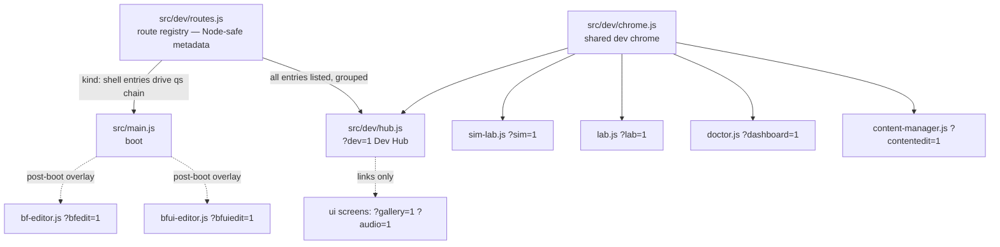

# refactor: Consolidate dev tooling into a single Dev Hub

## Summary

Glassvow's dev/backend tooling (~7,400 lines) is split across two directories (`src/dev/`, `src/ui/dev/`) with cross-imports in both directions, a static `?dev=1` launcher that doesn't know about the new Proving Grounds sim module, and a hand-rolled `qs.has(...)` chain in `src/main.js` that can silently drift from the launcher's route list. This plan unifies all dev tooling under one `src/dev/` root, introduces a single route registry consumed by both `main.js` and the hub, upgrades `?dev=1` into a proper grouped Dev Hub, and applies a consistent chrome (header + back-link) across the standalone dev shells. Query params, save endpoints, and the production-exclusion guarantee all stay unchanged.

**Context:** the game now renders through Pixi and the next steps are Capacitor ports (iOS/Android) and Steam binaries (Win/Mac). The load-bearing constraint is that dev tooling must remain cleanly excluded from production bundles — `tools/verify-production-surface.mjs` already guards this and must stay green throughout.

---

## Problem Frame

- Dev tooling is scattered: `src/dev/` holds editors, serializers, and `sim-lab.js`; `src/ui/dev/` holds Content Lab, doctor, content-manager, replay-preview, and the launcher shell. `src/ui/dev/lab.js` imports `src/dev/lab-scenario.js` and `src/ui/dev/content-manager.js` imports `src/dev/content-serialize.js` — the boundary carries no meaning anymore.
- The `?dev=1` shell (`src/ui/dev/shell.js`) is a static, flat list missing the sim lab (`?sim=1`) entirely; its `ROUTES` array duplicates knowledge that also lives in `main.js`'s routing chain, with no drift check.
- Most standalone tools hand-roll similar-but-drifting dark-parchment styling (sim-lab is the deliberate exception — it uses its own violet/teal "observatory" palette and grid layout); none link back to the hub.
- With commercial packaging ahead (Capacitor, Steam), the dev surface deserves a deliberate structure and an explicit, tested production-exclusion story rather than an incidental one.

---

## Requirements

- **R1** — All dev-only tooling lives under a single `src/dev/` root; `src/ui/dev/` is removed.
- **R2** — `?dev=1` renders a grouped Dev Hub listing every dev tool **including the sim lab**, with one-line descriptions; all existing query-param URLs unchanged.
- **R3** — A single route registry is the source of truth for dev routes; `main.js`'s standalone-shell chain and the hub's list are both derived from it and cannot drift (drift is test-guarded).
- **R4** — Standalone dev shells share a consistent chrome: the four tool shells (sim lab, Content Lab, doctor, content-manager) render a common header bar with tool title and a "Dev Hub" back-link; the hub itself renders a title-only header (no self-referential back-link) and retains a "back to game" link (`href="?"`, as the current shell has).
- **R5** — Production bundles contain no dev tooling: `tools/verify-production-surface.mjs` stays green with paths updated; `import.meta.env.DEV` gating preserved everywhere.
- **R6** — `npm test`, `npm run build`, and the affected Playwright specs (`dev-tools`, `lab`, `sim-lab`, `content-manager`, `bfeditor`, `bfuieditor`) pass; every test/guard that references moved paths is updated.
- **R7** — `AGENTS.md` architecture notes and any doc-index references reflect the new layout.

---

## Key Technical Decisions

- **KTD1 — Hub UI + module reorg, together.** *(session-settled: user-approved — chosen over hub-only or reorg-only: user picked the combined shape when asked.)* The hub upgrade and the directory unification land in one coherent round.
- **KTD2 — Consolidate into `src/dev/`, not `src/ui/dev/`.** Dev tooling is not part of the ui orchestrator; it is lazy-loaded siblings gated by `import.meta.env.DEV`. Moving `ui/dev/*` down into `src/dev/` keeps `src/ui/` purely production code and keeps the Node-tested serializers where they already are. Rejected alternative: consolidating upward into `src/ui/dev/` would put Node-pure serializers under the browser-only ui package and enlarge the production package's directory with dev-only code.
- **KTD3 — Registry describes routes; it does not unify boot paths.** `src/dev/routes.js` is a Node-safe module of route metadata (`id`, `param`, `label`, `description`, `group`, `kind`, lazy `load` thunk where applicable). `main.js` derives its standalone-shell chain (`sim`, `lab`, `dashboard`, `contentedit`, `dev`, `charedit`, `vfxedit`) from registry entries of kind `shell`; overlay editors (`bfedit`, `bfuiedit` — which require full game boot first) and production ui screens (`gallery`, `audio`) stay routed where they are and appear in the registry as metadata-only kinds (`overlay`, `screen`) so the hub can list them. Rejected alternative: a total routing abstraction — the overlay editors' post-boot injection and the sim lab's pre-`loadAudioSelection` early return make one mechanism strictly worse than two annotated regimes.
- **KTD4 — Query params and save endpoints unchanged.** `?sim=1`, `?bfedit=1`, `POST /__bf-save`, etc. all keep their names — they are muscle memory, documented in AGENTS.md, and anchored by e2e specs. Rejected alternative: a unified `?tool=<id>` scheme; churn with no capability gain.
- **KTD5 — Keep existing test anchors.** `[data-dev-shell]` and per-tool DOM anchors stay; `dev-tools.spec.js` is extended (sim entry, groups), not rewritten.

---

## High-Level Technical Design

Directional guidance, not implementation specification. Solid arrows are imports/derivation; dashed are link/boot relationships that deliberately stay outside the registry's loading mechanism.

---

## Implementation Units

### U1. Route registry (`src/dev/routes.js`)

- **Goal:** One Node-safe source of truth for every dev route.
- **Requirements:** R3.
- **Dependencies:** none.
- **Files:** `src/dev/routes.js` (new), `src/main.js`, `test/test_engine.js` (registry shape checks; **plus rework of the Task 18 source-contract assertions** (~lines 9250+) that pin `main.js` route literals like `contentedit`/`ui/dev/content-manager` — retarget them at `src/dev/routes.js` entries and the registry-driven loop in `main.js`).
- **Approach:** Frozen array of entries: `{ id, param, label, description, group, kind: 'shell' | 'overlay' | 'screen', load? }`. `load` is a lazy thunk (`() => import('./sim-lab.js')` style) present only on `kind: 'shell'` entries — thunks never execute at import time, so the module stays Node-importable. `main.js` replaces its hand-written standalone `qs.has` chain with a loop over `shell` entries, **preserving current semantics exactly**: `sim` resolves before `loadAudioSelection()`, the others after; `charedit`/`vfxedit` remain mutually exclusive with normal boot; `bfedit`/`bfuiedit` remain post-`initUI` overlays outside the registry-driven loop. Encode the sim-before-audio ordering as data (e.g. a `preAudio` flag) rather than a special case in prose.
- **Patterns to follow:** existing source-reading assertions in `test/test_engine.js` (e.g. the `lab-scenario.js` source check at ~line 9044) for drift guards; `Object.freeze` route lists as in current `shell.js`.
- **Test scenarios:**
  - Registry shape: every entry has unique `id` and `param`; every `shell` entry has a `load` thunk; `overlay`/`screen` entries have none.
  - Drift guard (source-grep style, consistent with existing checks): every remaining `qs.has('<param>')` literal in `src/main.js` corresponds to a registry param; every registry `overlay` param appears as a `qs.has` literal in `main.js`; `shell` coverage is guarded by asserting `main.js` imports `src/dev/routes.js` and contains **no** stale shell-param `qs.has` literals (the registry loop removes them, so requiring their presence would be unsatisfiable).
  - Node-import safety: `import('../src/dev/routes.js')` succeeds under plain Node (no DOM/localStorage touched).
- **Verification:** `npm test` passes; `?sim=1`, `?lab=1`, `?dashboard=1`, `?contentedit=1`, `?dev=1`, `?charedit=1`, `?vfxedit=1` all still boot their tools in the dev server.

### U2. Unify module layout under `src/dev/`

- **Goal:** Single dev root; `src/ui/dev/` removed.
- **Requirements:** R1, R5, R6.
- **Dependencies:** U1 (registry exists so moves update one import site).
- **Files:** `git mv src/ui/dev/lab.js src/dev/lab.js`, `src/ui/dev/doctor.js → src/dev/doctor.js`, `src/ui/dev/content-manager.js → src/dev/content-manager.js`, `src/ui/dev/replay-preview.js → src/dev/replay-preview.js`, `src/ui/dev/shell.js → src/dev/hub.js`; import updates in `src/main.js`, moved files' relative imports (`../ui/content.js`, `../ui/combat-presentation.js`, `../art.js`, etc.); `src/dev/routes.js` (update `load` thunk import paths for the moved modules, e.g. `./ui/dev/lab.js` → `./lab.js`); `test/test_engine.js` (`src/ui/dev/` references at ~lines 6309, 9250, 9258, 9267, and 9278, **plus** the Task 17 `assert.deepEqual` that pins the `FORBIDDEN_PRODUCTION_MARKERS` inventory — its four `ui/dev/*` strings must change in lockstep with `tools/verify-production-surface.mjs`); `tools/verify-production-surface.mjs` (path list entries `ui/dev/*` → `dev/*`).
- **Approach:** Pure move + import-path fixup, no behavior change. `dev → ui` imports (lab's `bindRunContent`, replay-preview's `createCombatPresentation`) are acceptable and stay: dev modules are DEV-only lazy siblings above the ui package. Use `git mv` to preserve history.
- **Test scenarios:** Test expectation: covered by existing suites — the moved modules' behavior is already pinned by `test_engine.js` (replay-preview source check, content-manager import check) and e2e (`lab.spec.js`, `content-manager.spec.js`, `dev-tools.spec.js`); the unit is complete when those pass against the new paths plus one updated `verify-production-surface` run.
- **Verification:** `npm test` green; `node tools/verify-production-surface.mjs` (or its invoking check) green; `rg "ui/dev" src/ test/ tools/` returns nothing but historical docs.

### U3. Dev Hub (`?dev=1`) upgrade

- **Goal:** The launcher becomes a real hub: grouped, complete (sim included), described.
- **Requirements:** R2, R3.
- **Dependencies:** U1, U2.
- **Files:** `src/dev/hub.js`, `src/dev/routes.js` (descriptions/groups), `test/e2e/dev-tools.spec.js`, `test/test_engine.js` (retarget the Task 19 source-contract assertions that pin `shell.js`'s per-route `id:`/`href:`/`available:` literals — point them at the registry instead of the rewritten hub markup).
- **Approach:** Hub renders from the registry — groups (suggested: **Simulation** [sim], **Editors** [bfedit, bfuiedit, charedit, vfxedit], **Content** [lab, dashboard, contentedit], **Art & Audio** [gallery, audio]) with each entry's label + one-line description + query-param badge. Keep `[data-dev-shell]` root anchor and the existing visual language (dark parchment, Cinzel) — polish, don't rebrand. The hub retains a "back to game" link (`href="?"`) equivalent to the current shell's, alongside the grouped tool list. Structural icons via `iconSvg` from `art.js` per repo convention. No endpoint health-pinging, no iframe embedding — links only.
- **Patterns to follow:** current `shell.js` style/escaping; `iconSvg` usage in `doctor.js`.
- **Test scenarios:**
  - `?dev=1` shows an entry linking to `?sim=1` (new — currently absent).
  - Every registry entry's `param` appears as a link href in the hub DOM; count of rendered entries equals registry length (drift-proof at the UI level).
  - Group headings render; existing `[data-dev-shell]` visibility assertion still passes.
- **Verification:** `npx playwright test test/e2e/dev-tools.spec.js` green; manual `?dev=1` spot-check in dev server.

### U4. Shared dev chrome

- **Goal:** Consistent header (tool title + "Dev Hub" back-link) across the standalone dev shells; stop per-tool style drift for the shared parts.
- **Requirements:** R4.
- **Dependencies:** U2.
- **Files:** `src/dev/chrome.js` (new, small), `src/dev/sim-lab.js`, `src/dev/lab.js`, `src/dev/doctor.js`, `src/dev/content-manager.js`, `src/dev/hub.js`.
- **Approach:** One helper exporting the shared header (title, `?dev=1` back-link, shared base CSS custom properties for the parchment palette). `lab.js`, `doctor.js`, and `content-manager.js` mount it above their existing UI; the hub mounts the title-only variant (no self back-link). **Sim-lab is a special case:** it deliberately uses a different palette (violet/teal "observatory", Alegreya) and a full-viewport CSS grid with a sticky rail — do not mount the generic bar above it or impose the parchment custom properties. Instead, wire the "Dev Hub" back-link into sim-lab's existing `.pg-top` toolbar (or `.pg-brand` rail header) via a small slot/prop on the chrome helper, and exempt it from the shared palette. **Overlay editors (`bfedit`, `bfuiedit`) and the char/vfx editors are explicitly untouched** — they float over the live game and have their own interaction chrome. Keep the helper under ~100 lines; this is polish, not a design system.
- **Patterns to follow:** existing inline `const STYLE = \`...\`` + injected `<style>` idiom used by every dev tool.
- **Test scenarios:**
  - e2e: each of `?sim=1`, `?lab=1`, `?dashboard=1`, `?contentedit=1` renders the back-link anchor (one shared selector, e.g. `[data-dev-home]`) pointing to `?dev=1` (extend existing specs minimally — one assertion each, in already-existing spec files).
  - Existing per-tool e2e assertions (lab panel, sim tabs, doctor dashboard) still pass — chrome must not cover or displace tool UI.
- **Verification:** affected e2e specs green; visual spot-check that headers align across tools.

### U5. Docs and guard alignment

- **Goal:** The repo's self-description matches the new layout.
- **Requirements:** R5, R7.
- **Dependencies:** U2, U3.
- **Files:** `AGENTS.md` (architecture diagram's `ui/` line — "dev/ is dev-only tooling" wording — and the module graph mention of `ui/dev`), `docs/README.md` (if it indexes dev-tool docs), `docs/proving-grounds.md` (only if it references `src/dev/sim-lab.js` paths that changed — sim-lab does not move, so likely a no-op check), memory of `test/fixtures/act-coupling-allowlist.json` (update only if it pins `ui/dev` paths).
- **Approach:** Mechanical doc pass. Historical plans/specs under `docs/superpowers/` are records — do **not** rewrite them.
- **Test scenarios:** Test expectation: none — docs-only unit; correctness is `rg "ui/dev" AGENTS.md docs/README.md` returning nothing stale.
- **Verification:** `npm test` + `npm run build` green at branch tip; `verify-production-surface` green.

---

## Scope Boundaries

**In scope:** everything above — registry, reorg, hub, shared chrome, docs/guards.

**Out of scope (true non-goals):**
- Renaming query params or save endpoints (KTD4).
- Touching the production game surface, ui screens (`gallery`/`audio` remain ui screens — hub links to them), or engine/vigil modules.
- Capacitor/Steam packaging work itself — this round only preserves the exclusion invariant those ports depend on.

### Deferred to Follow-Up Work
- Endpoint health/status indicators in the hub (e.g. pinging `/__sim-status`) — nice-to-have, adds no capability now.
- Chrome adoption for the char/vfx/bf/bfui editors — different interaction model; revisit only if drift becomes a real cost.
- A `docs/dev-hub.md` tool-by-tool guide — AGENTS.md already carries the per-tool one-liners.

---

## Verification Contract

1. `npm test` — unit checks + monte-carlo, including the new registry shape and drift assertions.
2. `npm run build` — clean production build; `tools/verify-production-surface.mjs` (with updated paths) confirms no dev module in `dist/`.
3. Playwright: `dev-tools.spec.js`, `lab.spec.js`, `sim-lab.spec.js`, `content-manager.spec.js`, `bfeditor.spec.js`, `bfuieditor.spec.js` green (the affected subset; full lanes run in CI).
4. Manual dev-server sweep: every registry route boots its tool; hub back-links return to `?dev=1`.

## Definition of Done

- R1–R7 all hold; the five units land dependency-ordered (U1 → U2 → U3/U4 → U5).
- `src/ui/dev/` no longer exists; `rg "ui/dev" src/ test/ tools/` is clean.
- The hub lists the sim lab and every other tool, grouped, with unchanged URLs.
- Production-surface guard green; no new dependency added.

## Assumptions

- "Commercial engine" context (Pixi + upcoming Capacitor/Steam) implies no packaging work in this round — only preserving the dev-exclusion invariant. Confirmed by user during scoping.
- The `gallery`/`audio` ui screens stay production screens (they are not DEV-gated today); changing that is out of scope.

## Operational Notes

- Execution delegation: per the user's global subagent routing, implementation units are good candidates for external tiers (`grok-worker` for U1–U3, `gpt-terra` for U5 docs pass); U4's visual chrome may warrant `opus-designer` review only if the result needs design judgment beyond matching the existing palette. After every delegation, review `git diff` before proceeding.
